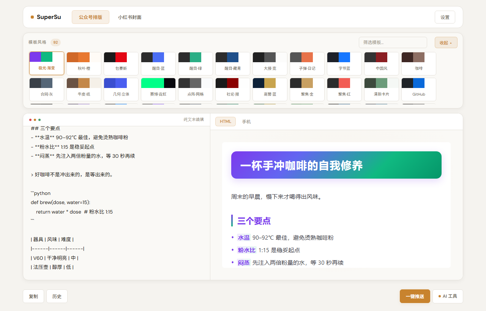
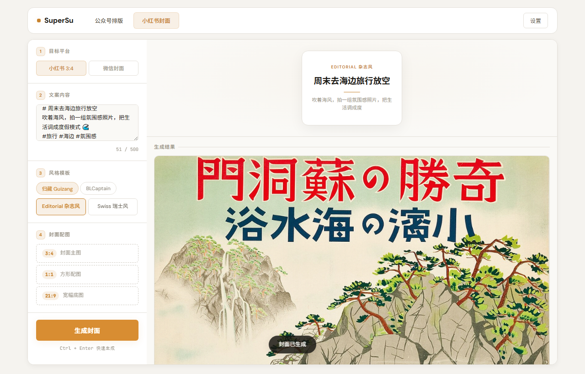
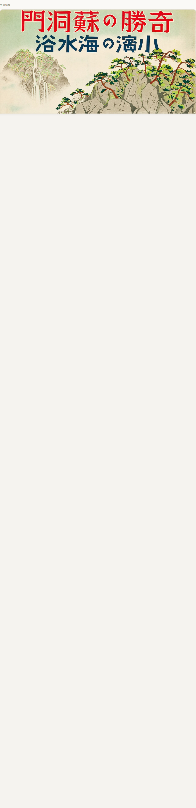
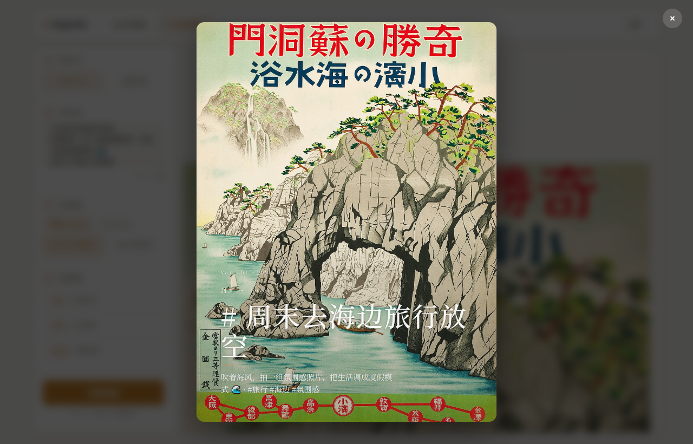

# SuperSu 🎨 公众号排版 + 小红书封面工具

> **粘贴纯文本，自动排版。不需要 AI 的时候，一步都不用点。**

[](https://python.org)
[](https://flask.palletsprojects.com)
[](https://playwright.dev)
[](LICENSE)

---

## ✨ 功能亮点

| 🎯 功能 | 💡 说明 |
|:--------|:---------|
| **📝 自动排版** | 粘贴纯文本 → 自动识别标题 / 列表 / 引用 → Markdown → **92 套主题**任选（纯本地规则，零延迟零费用） |
| **🖼️ 小红书封面** | 输入文案 → 选风格 → 一键生成 3:4 / 1:1 / 21:9 封面图（**双引擎**：归藏设计系统 + BLCaptain） |
| **🌐 自动联网搜底图** | 封面自动从 Wikimedia Commons 搜索真实照片作背景（免 API Key），带来源署名；可选升级 Pexels |
| **🤖 AI 润色** | 折叠在弹窗里，需要时展开。去 AI 味 / 正式 / 轻松三种风格 |
| **📋 AI 摘要** | 自动提取 80–100 字摘要 |
| **🚀 公众号推送** | 选择账号 → 生成封面 → 一键推送到微信草稿箱 |
| **🔒 数据本地** | 全部运行在本地，API Key 加密存储，不上传任何内容到第三方 |

核心理念：**不做不需要的事。** 默认就是输入→排版，AI 功能全部折叠，点了才展开。

---

## 📝 公众号自动排版

顶部紧凑模板条展示全部 **92 套主题**的配色色卡，点击即切换。下方左侧输入区支持实时预览，右侧手机框实时渲染。

<p align="center">
  
</p>
<p align="center"><i>92 套主题色卡条 + 实时 Markdown 预览 + 手机框渲染</i></p>

### 排版能力一览

- ✅ 标题 h1–h6、粗体、斜体、行内代码、链接
- ✅ 有序 / 无序列表（嵌套 3 层）
- ✅ 引用块、代码块（语法高亮）、表格
- ✅ Callout（tip / note / warning）
- ✅ 脚注、图片占位符
- ✅ 全部由**纯本地正则规则**完成预处理，零 AI 参与

---

## 🖼️ 小红书一键生成封面

**这是本工具最酷的功能之一：** 输入一段文案，选一个风格，点「生成封面」——系统会自动：

1. 🔍 从文案中提取关键词（零 AI，规则映射）
2. 🌐 联网搜索 Wikimedia Commons 真实照片（或 Pexels，如有 Key）
3. 🎨 用双引擎之一将文字 + 底图合成精美封面
4. 📸 输出 3 种比例 + 自动署名来源

<p align="center">
  
</p>
<p align="center"><i>左：控制面板（目标平台 / 文案 / 风格选择 / 封面配置）<br>右：模板预览 + 已生成的真实封面图（日本旅行海报底图来自 Wikimedia Commons）</i></p>

### 生成的封面长什么样？

结果画廊以网格展示所有比例的封面，点击可放大查看 Lightbox 大图。

<p align="center">
  
  &nbsp;&nbsp;
  
</p>
<p align="center"><i>左：结果画廊网格 &nbsp;|&nbsp; 右：Lightbox 全屏大图（含底图署名）</i></p>

### 双引擎阵容

| 引擎 | 风格数 | 风格名 | 特点 |
|:-----|:------:|:-------|:-----|
| **归藏 Guizang** | 2 | Editorial 杂志风 / Swiss 瑞士风 | HTML 模板 + Playwright 截图，自包含 |
| **BLCaptain** | 9 | 雾野 / 暖书房 / 海岸 / 夜纹 / 炉台 / 电蓝 / 石墨薄荷 / 安全珊瑚 / 酸性青柠 | Node.js CLI + Playwright，设计感强 |

### 🌐 自动搜图机制

```
用户文案 "周末去海边旅行放空"
    ↓ 规则提取关键词（零 AI）
关键词 = "travel"
    ↓ 双轨搜索
┌─ Pexels API（需 PEXELS_API_KEY 环境变量）← 更精准，200 次/时
│   └── 返回高清摄影作品 + 作者 + 许可证
│
└─ Wikimedia Commons（默认，无需任何 Key）✅ 开箱即用
    └── 返回 CC / Public Domain 作品 + 作者 + 许可证
         ↓ 缓存到 data/bg_cache/
    注入封面引擎（归藏 data URI 内嵌 / BLCaptain 文件路径）
         ↓
    用户看到：真实照片底图 + 中文标题叠加 + 底图署名条
```

---

## 🎨 主题一览

**92 套主题** = 45 套原创 + 47 套开源适配（xh-* 前缀）

### 原创系列（45 套）

| 系列 | 代表主题 | 风格 |
|:-----|:---------|:-----|
| 卡片系 | warm-card / fresh-card / ocean-card | 温暖卡片 |
| 深度长文 | newspaper / magazine / ink / coffee-house | 杂志质感 |
| 科技产品 | bytedance / github / sspai / midnight | 极客暗调 |
| 文艺随笔 | terracotta / mint-fresh / sunset-amber / lavender-dream | 温柔色调 |
| 活力动态 | sports / bauhaus / chinese / wechat-native | 高对比 |
| 模板布局 | bold-blue / bold-navy / bold-green / focus-gold | 干净利落 |

### 开源适配系列（47 套，xh-* 前缀）

适配自 [xiaohu-wechat-format](https://github.com/xiaohu-wechat-format) 的设计语言，覆盖：
粗野主义 · 瑞士网格 · 孟菲斯 · 蒸汽波 · 学术论文 · 苹果渐变 · 终端矩阵 · 打字机 · 故事书 · 和纸墨韵 … 等 47 种独立设计

---

## 🏗️ 架构

```mermaid
graph TB
    subgraph Frontend["🌐 前端 SPA"]
        A[index.html<br/>单页应用]
        A --> B[公众号页 #page-wechat]
        A --> C[小红书页 #page-social]
        B --> B1[模板色卡条 .tpl-strip<br/>92 套主题]
        B --> B2[输入区 + 手机预览]
        C --> C1[控制面板]
        C --> C2[结果画廊 + Lightbox]
    end

    subgraph Backend["⚙️ Flask 后端"]
        D[app.py<br/>路由 + SSE + API]
        D --> E[/api/render<br/>Markdown 渲染]
        D --> F[/api/social/generate<br/>封面生成]
        D --> G[/api/polish /summary<br/>AI 可选]
        D --> H[/api/push<br/>微信推送]
    end

    subgraph Engines["🔧 渲染引擎"]
        E --> E1[preprocessor.py<br/>纯文本→MD]
        E1 --> E2[format_engine.py<br/>92 主题 MD→HTML]
        F --> F0[image_search.py<br/>联网搜真图]
        F0 --> F1[guizang_renderer.py<br/>归藏引擎]
        F0 --> F2[blcaptain_bridge.py<br/>BLCaptain 引擎]
    end

    subgraph External["🌍 外部服务（按需）"]
        G1[LLM API<br/>阿里云/OpenAI 等]
        G2[Wikimedia Commons<br/>免费图片搜索]
        G3[Pexels API<br/>可选升级]
        H1[微信公众平台 API]
    end

    Frontend --> Backend
    G -.->|可选| G1
    F0 --> G2
    F0 -.->|有 Key| G3
    H --> H1
```

---

## 🚀 快速开始

```bash
# 1️⃣ 安装依赖
pip install -r requirements.txt

# 2️⃣ 安装 Chromium（封面生成必需）
playwright install chromium

# 3️⃣ 启动
python app.py
# 浏览器打开 http://127.0.0.1:5000
```

### 可选配置 `.env`

```bash
# AI 功能（不配也能用核心排版 + 封面生成）
LLM_BASE_URL=https://dashscope.aliyuncs.com/compatible-mode/v1
LLM_API_KEY=sk-your-key
LLM_MODEL=qwen-plus

# 图片搜索升级（不配则默认用 Wikimedia Commons 免费版）
PEXELS_API_KEY=your-pexels-key
```

> ⚠️ **注意**：`.env` 含密钥，已被 `.gitignore` 排除，不会入库。

---

## 🧪 测试

```bash
# E2E（无需起服务，Flask test_client）
python tests/test_e2e.py              # 40/41 通过

# 集成测试（需先启动 python app.py）
python tests/test_integration.py       # 35/35 通过

# 有头浏览器用户流程验证（需 Chromium）
python tests/test_headed_userflow.py   # 7/7 通过
```

健康度口径：**E2E 40/41 + 集成 35/35 + 有头冒烟 7/7**。

---

## 📁 项目结构

```
wechatca2/
├── app.py                      # Flask 主应用（~30 条路由）
├── core/
│   ├── format_engine.py        # 排版引擎（92 主题 Markdown → 微信 HTML）
│   ├── preprocessor.py         # 纯文本 → Markdown（正则规则，零延迟）
│   ├── image_search.py         # 🆕 联网搜图（Wikimedia / Pexels 双轨）
│   ├── guizang_renderer.py     # 归藏封面渲染器（Playwright HTML→PNG）
│   ├── blcaptain_bridge.py     # BLCaptain 封面引擎适配层（Node.js）
│   ├── ai_client.py            # 多平台 LLM 客户端
│   ├── image_gen.py            # AI 封面图生成（Pillow fallback）
│   ├── wechat_publisher.py     # 微信公众号草稿推送
│   ├── token_manager.py        # 微信 Access Token 管理
│   └── crypto_utils.py         # API Key 加密存储
├── templates/
│   └── index.html              # 单页前端 SPA（公众号 + 小红书双页面）
├── public/
│   ├── themes/*.json           # 92 套排版主题 JSON 配置
│   ├── cover-templates/        # 归藏封面 HTML 模板
│   ├── images/                 # 本地库存图（最终兜底）
│   └── social-thumb/           # 封面缩略图
├── scripts/                    # 工具脚本（主题生成/去重/适配等）
├── tests/                      # E2E + 集成 + 有头测试
├── docs/
│   ├── screenshots/            # 📷 README 配图
│   └── prototypes/             # 早期原型（已废弃）
├── AGENTS.md                   # 项目规则与工程纪律（Agent 必读）
├── HANDOFF.md                  # 系统状态交接文档
├── CLOSURE.md                  # 任务收尾记录
├── claude.md                   # Claude Agent 项目规则
└── references/                 # 归藏设计系统参考文档
```

---

## 📖 文档索引

| 文档 | 内容 |
|:-----|:-----|
| [AGENTS.md](AGENTS.md) | 项目定位、架构速查、路由表、工程纪律、验收规则 |
| [HANDOFF.md](HANDOFF.md) | 系统模块状态、执行链路、已知问题、环境配置 |
| [CLOSURE.md](CLOSURE.md) | 任务收尾记录（完成项 / 验证 / 回滚点 / 剩余项） |
| [claude.md](claude.md) | 给 AI Agent 读的项目规则（路由表、架构、注意事项） |

---

## 📄 License

MIT License — 自由使用、修改、分发。

---

<p align="center">
  <b>SuperSu</b> — 让排版像喝咖啡一样简单 ☕
</p>
