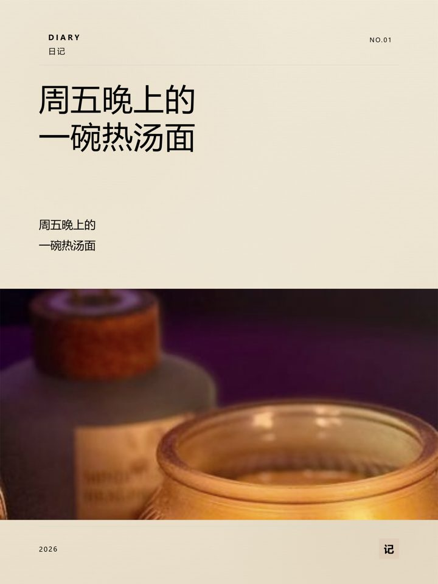
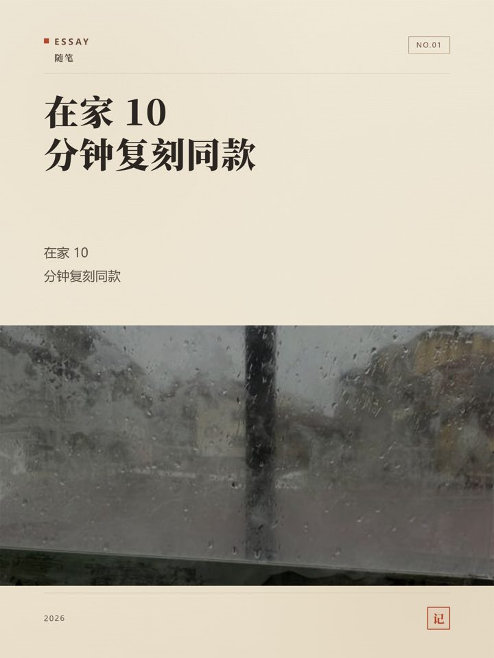

# 🚀 SuperSu — 公众号排版 + 小红书封面，一条龙

> **别再为排版跟编辑器搏斗半小时。**
> 粘贴纯文本 → 好看的公众号排版；一句话 → 3 张小红书封面。
> 全程本地运行 · 默认零 AI · 开箱即用。

[](https://python.org)
[](https://flask.palletsprojects.com)
[](https://playwright.dev)
[](https://www.pexels.com/api/)
[](#-测试矩阵)
[](#-license)

<p align="center">
  
  &nbsp;
  
</p>
<p align="center"><i>左：公众号排版（92 套主题 · 实时预览）｜ 右：小红书封面（双引擎 · 一键 3 张）</i></p>

---

## 🖼️ 真实产出

<p align="center">
  
  &nbsp;
  
  &nbsp;
  
</p>
<p align="center">
  
  &nbsp;
  
  &nbsp;
  
</p>
<p align="center"><i>旅行 · 咖啡探店 · 情感治愈 · 效率工具 · 美食 · 家居收纳 —— 六种主题 × 六种风格，底图来自 Pexels 中文检索，全部一键生成</i></p>

---

## 💥 为什么是 SuperSu

| 😫 你可能正在经历 | ✅ SuperSu 给你的 |
|:------------------|:------------------|
| 公众号后台调格式半小时，粘过去还是乱 | **粘贴即排版**：92 套主题、实时预览、复制即得 |
| 小红书封面不会设计、请设计又太贵 | **一句话生成 3 张**：3:4 / 1:1 / 21:9，双引擎任选 |
| 在线工具要注册账号、文案上传到别人服务器 | **全本地运行**：数据不出门，API Key 加密存储 |
| AI 工具每篇文章都烧 token、还越改越怪 | **默认零 AI**：本地规则引擎，需要 AI 时折叠在弹窗里随叫随到 |
| 网上搜配图十分钟，配出来还不搭 | **自动联网配图**：Pexels 中文优先，搜不到会明说、绝不硬塞 |

> 🧭 **核心理念：不做不需要的事。** 默认就是「输入 → 排版」，AI 全部折叠，点了才展开。

---

## ⚡ 30 秒上手

```
        📝 公众号排版                      🖼️ 小红书封面
   ┌─────────────────────┐          ┌─────────────────────┐
   │ ① 📋 粘贴你的文章     │          │ ① 🎯 选「发到哪」+样式 │
   │    （第一行自动当标题）│          │ ② ✍️  写文案          │
   │ ② 🎨 点色卡选主题      │          │ ③ 🚀 点生成 → 一次 3 张│
   │ ③ 📋 点「复制」直接发  │          └─────────────────────┘
   └─────────────────────┘
```

> 💡 **第一次用？** 打开页面就会看到内置教程（右下角可随时重开），两个页面各 30 秒看完。

---

## 📊 一图看懂 SuperSu 有多少家底

| | | | | |
|:---:|:---:|:---:|:---:|:---:|
| **92**<br>🎨 排版主题 | **11**<br>🖼️ 封面风格 | **3**<br>📐 输出比例 | **168**<br>🧪 自动化测试 | **0**<br>💸 默认模式 AI 开销 |

- 🎨 **92 套排版主题** = 45 套早期原创 + 47 套自研原创（深色首屏 / 杂志大字 / 纸感手记 / 暗底沉浸 / 便签 / 网格 / 终端……）
- 🖼️ **11 种封面风格** = 归藏设计系统（杂志 / 瑞士）+ BLCaptain（雾野 / 暖书房 / 海岸 / 夜纹 / 炉台 / 电蓝 / 石墨薄荷 / 安全珊瑚 / 酸性青柠）
- 🧪 **168 项自动化测试** = 单元 + E2E + API 全端点 + 有头浏览器全按钮，0 控制台报错

---

## ✨ 核心功能

| 🎯 功能 | 💡 说明 |
|:--------|:---------|
| **📝 自动排版** | 粘贴纯文本 → 自动识别标题 / 列表 / 引用 → Markdown → **92 套主题**任选（纯本地规则，零延迟零费用） |
| **🖱️ 主题即划即看** | 鼠标划过色卡，预览立刻换装；**最近使用 + 收藏**自动置顶，常用的永远在手边 |
| **🖼️ 小红书封面** | 输入文案 → 选风格 → 一键生成 **3:4 / 1:1 / 21:9**（双引擎：归藏设计系统 + BLCaptain，标题字号自适应，永不溢出） |
| **🌐 自动联网配图** | **Pexels 中文优先**（原生 zh-CN，图贴题）→ Wikimedia 兜底 → 都没有就明确告诉你，**绝不硬塞无关图片**；全自动署名 |
| **⏳ 生成有反馈** | 生成中显示真实阶段（找底图 → 排版 → 完成），按钮置灰防重复点，不让你对着一动不动的界面干等 |
| **🤖 AI 润色 / 摘要 / 排版** | 折叠在弹窗里按需展开；AI 失败自动本地兜底并说明原因，**永不静默** |
| **🚀 一键推送** | 选账号 → 生成封面 → 推送到微信草稿箱，含推送历史 |
| **🔒 数据本地** | 全部本地运行，API Key 加密存储，不上传任何内容到第三方 |
| **📖 内置教程** | 两个页面各 30 秒看完，首次自动出现，随时点「教程」重开 |

---

## 📝 公众号自动排版

顶部紧凑模板条展示全部 **92 套主题**的配色色卡（支持搜索、点击切换、收藏置顶）。下方左侧输入区支持实时预览，右侧手机框实时渲染，复制按钮写入**富文本**——粘贴到公众号后台，样式原样保留。输入框上方有「**插入模块**」下拉，可直接插入排版模块模板，不用记语法。

### 排版能力一览

- ✅ 标题 h1–h6、粗体、斜体、行内代码、链接
- ✅ 有序 / 无序列表（嵌套 3 层）
- ✅ 引用块、代码块（语法高亮）、表格
- ✅ Callout（tip / note / warning）
- ✅ 脚注、图片占位符
- ✅ **排版模块**（`:::` 围栏语法，可插入到正文任意位置）：
  `eyebrow` 小标签 / `cards` 卡片组 / `summary` 要点总结 / `cta` 行动引导 /
  `stat` 关键数字 / `steps` 步骤流程 / `timeline` 时间线 / `compare` 对比卡片 /
  `quote` 引文卡 / `dialogue` 对话气泡 / `gallery` 图集 / `longimage` 长图
- ✅ **四种页面布局**（由主题的 `layout` 字段决定）：普通排版、`card` 卡片分节、
  `hero` 深色首屏 + 大序号 + 交替色带 + 引文穿插、`timeline` 左侧时间线
  （色带按主题强调色派生，保证肉眼能看出深浅交替，不会淡成看不见）
- ✅ 模块配色跟随主题色系（accent / 正文色 / 页面底色），切换主题时模块一起换装
- ✅ 全部由**纯本地正则规则**完成预处理，零 AI 参与
- ✅ **智能排版**（可选 AI）：AI 只出结构决策、不改写正文，失败自动本地兜底并说明原因

---

## 🖼️ 小红书一键生成封面

输入一段文案，选一个风格，点「生成封面」——系统自动完成：

1. 🔍 从文案中提取关键词（本地词典；配置 AI 后升级为 LLM 精准提取）
2. 🌐 联网搜索真实照片作底图（Pexels 中文优先 → Wikimedia 兜底）
3. 🎨 双引擎将文字 + 底图合成封面（**标题字号自适应**，长文案不溢出）
4. 📸 输出 3 种比例 + 自动署名来源 + 生成过程实时可见

<details>
<summary><b>🔍 底图搜索机制（点开看流程）</b></summary>

```
用户文案 "周末去海边旅行放空"
    ↓ 提取关键词（本地词典；配置 AI 后可升级为 LLM 精准提取）
关键词 = "travel"
    ↓ 双轨搜索（中文查询自动走 zh-CN）
┌─ Pexels API（推荐配置，原生支持中文）← 图最贴题，200 次/时
│   └── 竖版优先 · 返回高清摄影作品 + 作者 + 许可证
│
└─ Wikimedia Commons（无需任何 Key）✅ 开箱即用
    └── 返回 CC / Public Domain 作品（偏百科/地理，中文场景可能不贴题）
         ↓ 联网成功的结果缓存到 data/bg_cache/（降级结果不缓存，不会固化错图）
    注入封面引擎（归藏 data URI 内嵌 / BLCaptain 文件路径）
         ↓
    用户看到：真实照片底图 + 中文标题叠加 + 底图署名条
    搜不到时：明确提示「联网没找到」，绝不硬塞无关图片
```

</details>

> 💡 **想让配图更贴题？** 到 [pexels.com/api](https://www.pexels.com/api/) 免费申请 key，右上角「设置」→「Pexels 图库 API」里粘贴，**保存后立即生效**（或写进 `.env`）。

### 双引擎阵容

| 引擎 | 风格数 | 风格名 | 特点 |
|:-----|:------:|:-------|:-----|
| **归藏 Guizang** | 2 | Editorial 杂志风 / Swiss 瑞士风 | HTML 模板 + Playwright 截图，杂志级排版 |
| **BLCaptain** | 9 | 雾野 / 暖书房 / 海岸 / 夜纹 / 炉台 / 电蓝 / 石墨薄荷 / 安全珊瑚 / 酸性青柠 | Node.js CLI + Playwright，设计感强，标题字号自适应 |

<details>
<summary><b>🖼️ 更多界面截图</b></summary>

<p align="center">
  
  &nbsp;&nbsp;
  
</p>
<p align="center"><i>左：结果画廊网格 ｜ 右：Lightbox 全屏大图（含底图署名）</i></p>

</details>

---

## 🎨 主题一览

**92 套主题** = 45 套早期原创 + 47 套自研原创（`su-*` 前缀）

### 早期原创系列（45 套）

| 系列 | 代表主题 | 风格 |
|:-----|:---------|:-----|
| 卡片系 | warm-card / fresh-card / ocean-card | 温暖卡片 |
| 深度长文 | newspaper / magazine / ink / coffee-house | 杂志质感 |
| 科技产品 | bytedance / github / sspai / midnight | 极客暗调 |
| 文艺随笔 | terracotta / mint-fresh / sunset-amber / lavender-dream | 温柔色调 |
| 活力动态 | sports / bauhaus / chinese / wechat-native | 高对比 |
| 模板布局 | bold-blue / bold-navy / bold-green / focus-gold | 干净利落 |

### 自研系列（47 套，`su-*` 前缀）

全部由本项目的主题生成器产出：只声明「底色 / 墨色 / 强调色 / 字体气质」，字号标尺、间距、圆角、
描边、列表、代码块、暗色适配由统一设计系统推导，因此 47 套彼此协调、切换主题时不会忽大忽小。

| 系列 | 代表主题 | 布局 | 风格 |
|:-----|:---------|:-----|:-----|
| 首屏家族（10） | su-dusk-slate / -amber / -azure / -mauve / -sage … | `hero` | 深色首屏 + 大序号 + 交替色带 + 引文穿插 |
| 素排文档 | su-academic / su-quietdoc / su-glacier / su-gridline | — | 无装饰，靠字号与留白分层 |
| 杂志编辑部 | su-broadsheet / su-classicmuse / su-studio / su-gilded / su-roundtable | — | 大号衬线 + 强调色开篇 |
| 纸感手记 | su-scrollwork / su-notebook / su-xuanink / su-typograph / su-crimsonwashi … | — | 纸底 + 衬线/楷体，耐读 |
| 暗底沉浸 | su-nightsky / su-lamplight / su-console / su-drafting / su-neonwave | — | 暗底 + 高对比强调 |
| 分层卡纸 | su-frost-card / su-frostedglass | `card` | 大圆角浮起卡片分节 |
| 数据技术 | su-gauges / su-hardedge | — | 表头反白 / 粗黑边 |
| 明快活泼 | su-confetti / su-macaron / su-stickynote / su-picturebook | — | 多色点缀 + 大圆角 |
| 特殊节奏 | su-ribbon（色带）/ su-countdown（大序号）/ su-deepwater（暗色首尾屏）/ su-milestone（时间线） | `hero` / `timeline` | 单一手法做满 |

---

## 🏗️ 架构

```mermaid
graph TB
    subgraph Frontend["🌐 前端 SPA"]
        A[index.html<br/>单页应用]
        A --> B[公众号页 #page-wechat]
        A --> C[小红书页 #page-social]
        B --> B1[模板色卡条 .tpl-strip<br/>92 套主题 · 点击切换 · 收藏置顶]
        B --> B2[输入区 + 手机预览]
        C --> C1[控制面板]
        C --> C2[结果画廊 + Lightbox]
    end

    subgraph Backend["⚙️ Flask 后端"]
        D[app.py<br/>路由 + SSE + API]
        D --> E[/api/render<br/>Markdown 渲染]
        D --> F[/api/social/generate<br/>封面生成]
        D --> G[/api/polish /summary<br/>AI 可选]
        D --> H[/api/push<br/>微信推送]
    end

    subgraph Engines["🔧 渲染引擎"]
        E --> E1[preprocessor.py<br/>纯文本→MD]
        E1 --> E2[format_engine.py<br/>92 主题 MD→HTML]
        F --> F0[image_search.py<br/>联网搜真图]
        F0 --> F1[guizang_renderer.py<br/>归藏引擎]
        F0 --> F2[blcaptain_bridge.py<br/>BLCaptain 引擎]
    end

    subgraph External["🌍 外部服务（按需）"]
        G1[LLM API<br/>阿里云/OpenAI 等]
        G2[Wikimedia Commons<br/>免费图片搜索]
        G3[Pexels API<br/>推荐 · 原生中文]
        H1[微信公众平台 API]
    end

    Frontend --> Backend
    G -.->|可选| G1
    F0 --> G2
    F0 -.->|有 Key| G3
    H --> H1
```

---

## 🚀 快速开始

### ✅ 推荐：一键启动（零门槛）

项目根目录有一份 **`start-app.bat`**，双击即可：

1. 自动用项目自带的 `.venv` 运行（无需手动配环境）
2. 首次缺失依赖/浏览器时自动补装
3. 启动后**自动打开浏览器**到 `http://127.0.0.1:5000`
4. 关闭那个黑窗口即停止服务（或按 `Ctrl+C`）

> ⚠️ **必须从「文件资源管理器（文件夹）」里双击**，不要在 VS Code / 编辑器的文件树里双击——那样只会把 `.bat` 当文本打开，不会运行。
> ❌ **不要双击 `app.py`**：它不能直接运行（系统 Python 缺依赖会秒退），`app.py` 只由 `start-app.bat` 调用。

### 🔧 手动启动（开发者）

```bash
# 1️⃣ 安装依赖（首次）
.venv\Scripts\python.exe -m pip install -r requirements.txt
.venv\Scripts\python.exe -m playwright install chromium

# 2️⃣ 启动
.venv\Scripts\python.exe app.py
# 浏览器打开 http://127.0.0.1:5000
```

> 💡 这里直接调用 `.venv\Scripts\python.exe`，而不是 `.venv\Scripts\activate`：
> `activate` 脚本里写死了创建虚拟环境时的绝对路径，**项目一旦换目录就会静默失效**
> （激活后 `python` 会落到系统解释器上、报 `No module named 'flask'`）。
> 直接调 venv 里的解释器则与项目位置无关。

### 🎛️ 可选配置 `.env`

```bash
# AI 功能（不配也能用核心排版 + 封面生成）
LLM_BASE_URL=https://dashscope.aliyuncs.com/compatible-mode/v1
LLM_API_KEY=sk-your-key
LLM_MODEL=qwen-plus

# 封面自动配图（推荐：中文搜索更贴题；也可在「设置」弹窗里填，保存后立即生效）
PEXELS_API_KEY=your-pexels-key
```

> ⚠️ **注意**：`.env` 含密钥，已被 `.gitignore` 排除，不会入库。

---

## 🧪 测试矩阵

| 套件 | 项数 | 覆盖 |
|:-----|:----:|:-----|
| `tests/test_e2e.py` | **52** ✅ | 端到端（无需起服务，Flask test_client） |
| `tests/test_integration.py` | **35** ✅ | 前后端联动（需先起服务） |
| `tests/test_api_e2e.py` | **29** ✅ | 后端 API 全端点（自起/自停服务） |
| `tests/test_headed_full_e2e.py` | **33** ✅ | 前端有头浏览器全按钮（双页，0 控制台报错） |
| `tests/test_headed_userflow.py` | **7** ✅ | 有头用户主流程 |
| `tests/test_headed_wechat_copy.py` | **12** ✅ | 复制富文本 / 推送 / 封面旧资产 |
| **合计** | **168** | **全绿** |

```bash
# 快速自检（无需起服务）
python tests/test_e2e.py

# 有头全按钮（需 Chromium，脚本自起/自停服务）
python tests/test_headed_full_e2e.py
```

> 有头套件刻意不点 3 个有真实副作用的按钮——`确认推送`（真打微信接口）、`保存AI配置`、`测试连接`（会覆盖配置）；其后端路径由 `test_api_e2e.py` 覆盖。
> ⚠️ `test_e2e.py` 会读写 `data/*.json`，但已在测试前后做快照 / 还原；仍建议跑测前备份真实配置。

---

## 🗺️ 路线图

| 状态 | 计划 | 说明 |
|:----:|:-----|:-----|
| ✅ 已完成 | 92 主题排版 · 双引擎封面 · Pexels 中文配图 · 按页教程 · 生成进度反馈 | 当前版本 |
| 🔜 计划中 | **纯文字大字版式**（无底图、秒出、永不图文不符） | 小红书主流爆款形态 |
| 🔜 计划中 | **多源候选 + 相关性打分选优**（CLIP / LLM 评分） | 进一步提升图文匹配度 |
| 💡 探索中 | AI 生成专属底图 · 深色模式预览 · 模板可视化设计器 | 参考 WeMD / XHS_Cover 等开源实现 |

---

## 📁 项目结构

```
wechatca2/
├── app.py                      # Flask 主应用（25 条路由）
├── core/
│   ├── format_engine.py        # 排版引擎（92 主题 Markdown → 微信 HTML）
│   ├── preprocessor.py         # 纯文本 → Markdown（正则规则，零延迟）
│   ├── image_search.py         # 联网搜图（Pexels 中文优先 / Wikimedia 兜底 + 查询缓存）
│   ├── guizang_renderer.py     # 归藏封面渲染器（Playwright HTML→PNG，标题自适应）
│   ├── blcaptain_bridge.py     # BLCaptain 封面引擎适配层（Node.js）
│   ├── ai_client.py            # 多平台 LLM 客户端
│   ├── image_gen.py            # AI 封面图生成（Pillow fallback）
│   ├── wechat_publisher.py     # 微信公众号草稿推送
│   ├── token_manager.py        # 微信 Access Token 管理
│   └── crypto_utils.py         # API Key 加密存储
├── templates/
│   └── index.html              # 单页前端 SPA（公众号 + 小红书双页面 + 内置教程）
├── public/
│   ├── themes/*.json           # 92 套排版主题 JSON 配置
│   ├── cover-templates/        # 归藏封面 HTML 模板
│   ├── vendor/                 # 内联依赖（fitty 等）
│   ├── images/                 # 本地库存图（最终兜底）
│   └── social-thumb/           # 封面缩略图
├── scripts/                    # 工具脚本（主题生成/去重/UX 验收等）
├── tests/                      # E2E + 集成 + 有头测试（168 项）
├── docs/
│   ├── screenshots/            # 📷 README 配图
│   ├── ux-audit/               # UX 诊断报告与验收截图
│   └── prototypes/             # 早期原型（已废弃）
├── AGENTS.md                   # 项目规则与工程纪律（Agent 必读）
├── HANDOFF.md                  # 系统状态交接文档
├── CLOSURE.md                  # 任务收尾记录
├── claude.md                   # Claude Agent 项目规则
└── references/                 # 归藏设计系统参考文档
```

---

## 📖 文档索引

| 文档 | 内容 |
|:-----|:-----|
| [AGENTS.md](AGENTS.md) | 项目定位、架构速查、路由表、工程纪律、验收规则 |
| [HANDOFF.md](HANDOFF.md) | 系统模块状态、执行链路、已知问题、环境配置、变更记录 |
| [CLOSURE.md](CLOSURE.md) | 任务收尾记录（完成项 / 验证 / 回滚点 / 剩余项） |
| [claude.md](claude.md) | 给 AI Agent 读的项目规则（路由表、架构、注意事项） |

---

## 🤝 贡献

欢迎 Issue 与 PR。开发前请先读 [AGENTS.md](AGENTS.md) 的工程纪律（一次一问题、不顺手重构、改动须过测试矩阵）。

---

## 📄 License

MIT License — 自由使用、修改、分发。

---

<p align="center">
  <b>SuperSu</b> — 让排版像喝咖啡一样简单 ☕
</p>
