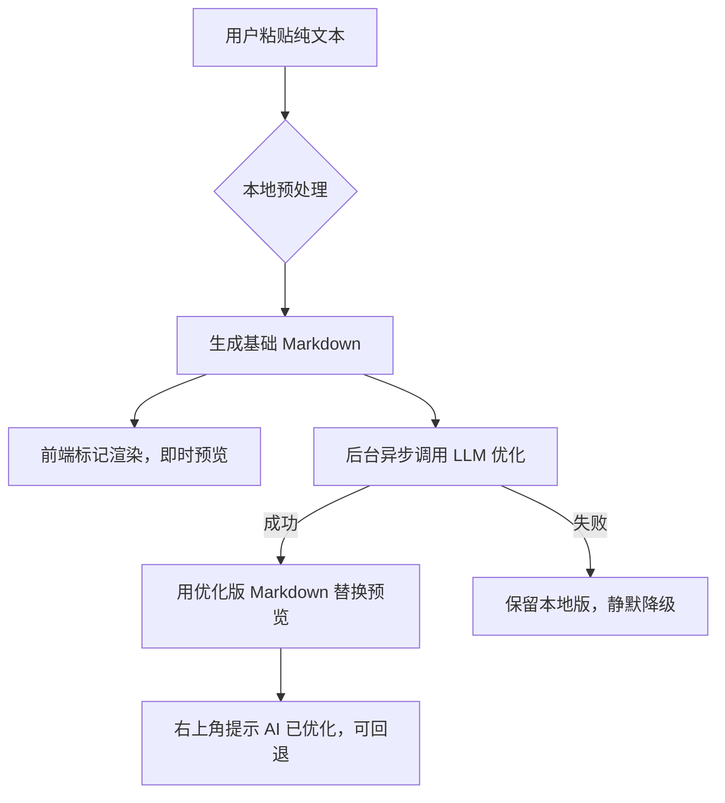

# 微信公众号 AI 自动排版工具 — 最终技术规格与实施文档

## 1. 项目概述

**项目名称**：WechatAI-Formatter  
**产品定位**：本地个人工具，双击启动的 Web 应用。用户粘贴纯文本 → 自动排版 → 实时预览 → 一键推送到微信公众号草稿箱。  
**核心价值**：把排版时间从 20 分钟降到 30 秒。  
**使用场景**：个人同时运营多个公众号，偶尔使用。

---

## 2. 技术架构

### 2.1 整体架构

```
┌─────────────┐     HTTP      ┌─────────────┐
│  浏览器前端  │ ◄──────────► │  Flask 后端  │
│ (HTML/JS)   │    AJAX       │  (Python)    │
└─────────────┘               └──────┬──────┘
                                     │
                          ┌──────────┼──────────┐
                          ▼          ▼          ▼
                     LLM API    文生图 API   微信公众平台API
                    (摘要/润色)  (标题图)    (草稿箱)
```

### 2.2 技术栈

| 层级 | 技术 | 说明 |
|------|------|------|
| 后端 | Python 3.10+, Flask | 单文件启动，自动打开浏览器 |
| 前端 | 原生 HTML/CSS/JS + marked.js | 无框架，轻量 |
| Markdown渲染 | marked.js（前端预览）+ mistune（后端推送时渲染） | 保证前后一致 |
| AI服务 | OpenAI 兼容格式（用户配置） | 通过 .env 配置 base_url/api_key/model |
| 文生图 | 用户配置的 API（如 SiliconFlow） | 输出 900x383 图片 |
| 图片处理 | Pillow | 标题叠加、fallback 生成纯色背景 |
| 微信API | requests | 草稿箱创建、素材上传 |
| 本地存储 | JSON 文件 | 公众号配置、排版历史 |
| 环境变量 | python-dotenv | 读取 .env |

### 2.3 目录结构

```
wechat-formatter/
├── app.py                    # Flask 主入口（唯一启动文件）
├── launcher.py               # 双击启动脚本（自动安装依赖并打开浏览器）
├── .env.example              # 环境变量模板
├── .env                      # 实际配置（不提交 git）
├── .gitignore
├── requirements.txt
│
├── core/
│   ├── __init__.py
│   ├── preprocessor.py       # 本地文本预处理（正则）
│   ├── ai_client.py          # 统一 LLM 调用客户端
│   ├── renderer.py           # Markdown → HTML + 模板注入
│   ├── wechat_api.py         # 微信草稿箱推送
│   ├── image_gen.py          # 标题图生成（含 fallback）
│   └── token_manager.py      # Access Token 缓存
│
├── assets/
│   ├── themes/               # 从 xiaohu-wechat-format 提取的 30 套主题
│   │   ├── themes.json       # 主题元数据（名称、分类、CSS文件路径）
│   │   ├── tech_blue.css
│   │   ├── tech_dark.css
│   │   └── ... (共约 35 个 CSS 文件)
│   └── fonts/
│       └── NotoSansSC-Regular.ttf  # 开源中文字体，用于封面图
│
├── data/                     # 运行时数据（不提交 git）
│   ├── accounts.json         # 公众号配置
│   └── history.json          # 最近 20 条排版记录
│
└── templates/
    └── index.html            # 单页应用（所有前端代码）
```

---

## 3. 环境配置

### .env 文件规范

```bash
# ===== 必填：LLM 服务（用于 AI 排版、润色、摘要） =====
LLM_BASE_URL=https://api.openai.com/v1
LLM_API_KEY=sk-xxxxx
LLM_MODEL=gpt-4o-mini

# ===== 必填：文生图服务（用于标题图背景生成） =====
IMAGE_GEN_BASE_URL=https://api.siliconflow.cn/v1
IMAGE_GEN_API_KEY=sk-xxxxx
IMAGE_GEN_MODEL=stabilityai/stable-diffusion-xl-base-1.0

# ===== 可选：自定义端口 =====
PORT=5000
```

### accounts.json 结构

```json
[
  {
    "id": "uuid1",
    "nickname": "我的技术号",
    "appid": "wx1234567890",
    "appsecret": "abcdef123456"
  }
]
```

文件存储在 `~/.wechat_formatter/accounts.json`（或项目 `data/` 目录）。  
**不加密**，通过 `.gitignore` 和系统文件权限保护。

---

## 4. 核心模块详细设计

### 4.1 文本预处理与 AI 排版（双模式）

#### 流程



#### 本地预处理规则（`preprocessor.py`）

处理 90% 的常见结构，无需 LLM 等待：

- **空行分段**：连续空行作为段落分隔。
- **标题识别**：短行（<30字）且无标点结尾，或者以数字/中文序号开头（一、/1.）→ 加 `##`。
- **引用块**：以 `> ` 或 `「` 开头 → 转为 `>`。
- **无序列表**：以 `-` `*` `•` 开头 → 保留。
- **有序列表**：以 `1.` `2.` 等开头 → 保留。
- **代码块**：缩进4空格或包含明显代码特征 → 转为 ` ``` ` 包裹。
- **加粗**：被 `**` 包裹或全角符号强调 → 保留。

**代码实现示例**：

```python
import re

def preprocess(text: str) -> str:
    lines = text.strip().split('\n')
    md_lines = []
    for line in lines:
        stripped = line.strip()
        if not stripped:
            md_lines.append('')
            continue
        # 序号标题
        if re.match(r'^[一二三四五六七八九十\d]+[、.．]\s*.{1,30}$', stripped):
            md_lines.append(f'## {stripped}')
        # 纯短行且无标点结尾（大概率是标题）
        elif len(stripped) <= 30 and not re.search(r'[。！？，、；：”’]', stripped[-1]):
            md_lines.append(f'## {stripped}')
        # 引用
        elif stripped.startswith('「') or stripped.startswith('"'):
            md_lines.append(f'> {stripped}')
        else:
            md_lines.append(stripped)
    return '\n\n'.join(md_lines)
```

#### LLM 优化提示词（后端调用时用）

```
你是一个文章排版助手。用户提供了一段纯文本，可能包含标题、段落、列表等。请以Markdown格式输出，严格遵循以下规则：
- 使用 ## 和 ### 作为标题层级，不要使用 #
- 段落之间用空行分隔
- 列表项使用 - 开头
- 引用内容用 > 开头
- 不要添加任何解释，只输出Markdown
输入文本：
{user_text}
```

#### 降级策略

- LLM 调用超时（10s）或失败 → 直接使用本地预处理结果。
- 前端始终保留 `raw_markdown`（本地版），允许用户一键切换回退。

---

### 4.2 模板系统

- 从 xiaohu-wechat-format 的 `themes/` 目录提取所有 CSS 文件，并补充少量基础样式。
- **themes.json 示例**：

```json
[
  {
    "id": "tech_blue",
    "name": "技术教程 - 蓝色代码",
    "category": "科技",
    "css_file": "tech_blue.css"
  },
  {
    "id": "literary_serif",
    "name": "文艺随笔 - 衬线体",
    "category": "生活",
    "css_file": "literary_serif.css"
  }
]
```

- 前端通过 `<select>` 选择模板，发送 `POST /api/render` 时携带 `theme_id`，后端读取对应 CSS 文件内容，注入到 HTML 模板的 `<style>` 中。

---

### 4.3 渲染引擎（`renderer.py`）

**接口**：`POST /api/render`  
**请求体**：

```json
{
  "raw_text": "...",
  "theme_id": "tech_blue"
}
```

**处理步骤**：

1. 调用 `preprocess(raw_text)` 生成本地版 Markdown。
2. 如果启用 AI 优化，异步调用 LLM 获取优化版 Markdown（非阻塞，立即返回本地版，优化完成后通过另一个接口或 SSE 推送）。
3. 将 Markdown（本地版或优化版）转换为 HTML（使用 `mistune`）。
4. 读取对应主题 CSS，将 HTML 嵌入预置的 HTML 骨架：

```html
<!DOCTYPE html>
<html>
<head>
<meta charset="UTF-8">
<style>
  /* 主题 CSS */
  {css_content}
</style>
</head>
<body>
  <div style="max-width:677px; margin:0 auto; padding:20px; word-wrap:break-word;">
    {html_body}
  </div>
</body>
</html>
```

5. 返回完整 HTML 字符串。

**前端预览**：

- 通过 iframe `srcdoc` 属性注入渲染结果。
- 完整 HTML 模式：iframe 宽度自适应。
- 手机预览模式：iframe 外套一个 iPhone 模拟框 div（带设备图片背景），iframe 固定宽度 375px，高度按比例缩放。

---

### 4.4 AI 润色（`POST /api/polish`）

**请求体**：

```json
{
  "text": "原文...",
  "style": "remove_ai_taste"  // 可选值: remove_ai_taste, formal, casual
}
```

**系统提示词（内置于后端）**：

```
你是一个文章润色助手。请对以下文本进行润色，要求：
- 保留原意，不改变事实
- 去除明显的AI生成痕迹，如“首先、其次、最后”、“总而言之”等
- 使用更自然的口语化表达，可以加入适当的设问、反问
- 保持文章流畅性
只输出润色后的文本，不要加任何解释。
```

**前端交互**：弹窗内纯文本对比（左侧原稿只读，右侧润色结果可编辑），提供“应用”按钮，应用后替换左侧编辑区内容并触发重新渲染。

---

### 4.5 AI 摘要生成（`POST /api/summary`）

**请求体**：

```json
{
  "article_text": "..."
}
```

**提示词**：

```
请为以下文章生成80-100字的人性化摘要。不要使用“本文”、“作者”等生硬开头，用自然的口吻总结文章核心内容，让读者有阅读欲望。
```

**返回**：纯文本摘要。

---

### 4.6 AI 标题图生成（`POST /api/cover-image`）

**实现策略**：文生图 + 本地 Pillow 降级。

**流程**：

1. 前端发送文章标题和正文全文到后端。
2. 后端调用 LLM 提取 5-8 个英文视觉关键词（用于文生图 prompt）。
3. **尝试调用文生图 API** 生成 900x383 的背景图（超时 30s）。
4. **如果成功**：下载图片，用 Pillow 将标题文字（白色带阴影）叠加在图片中央偏上位置。
5. **如果失败**（网络错误、超时、API 不支持该尺寸等）：
   - **自动 fallback** 到 Pillow 生成纯色渐变背景（颜色从模板主色提取，默认蓝色渐变）。
   - 叠加标题文字，输出同样尺寸的图片。
6. 返回最终图片的 base64 编码或保存为临时文件提供 URL。

**文生图 prompt 构建示例**：

```python
def build_image_prompt(keywords: list[str]) -> str:
    k = ", ".join(keywords)
    return f"Clean professional background for article cover, {k}, minimalistic, modern, soft colors, no text"
```

**Pillow fallback 代码**：

```python
from PIL import Image, ImageDraw, ImageFont
import io

def generate_fallback_cover(title: str) -> io.BytesIO:
    img = Image.new('RGB', (900, 383), color=(30, 115, 232))
    draw = ImageDraw.Draw(img)
    # 尝试加载内置字体，失败则用默认
    try:
        font = ImageFont.truetype("assets/fonts/NotoSansSC-Regular.ttf", 48)
    except:
        font = ImageFont.load_default()
    # 文字居中
    bbox = draw.textbbox((0,0), title, font=font)
    w, h = bbox[2]-bbox[0], bbox[3]-bbox[1]
    draw.text(((900-w)/2, (383-h)/2), title, font=font, fill=(255,255,255))
    buf = io.BytesIO()
    img.save(buf, format='PNG')
    buf.seek(0)
    return buf
```

**前端显示**：弹窗内 `` 标签，src 指向 `/api/cover-image` 返回的临时图片路径。提供“重新生成”按钮，再次调用该接口。

---

### 4.7 一键推送草稿箱（`POST /api/push`）

**请求体**：

```json
{
  "account_id": "uuid1",
  "title": "文章标题",
  "html_content": "<完整排版HTML>",
  "summary": "80-100字摘要",
  "cover_media_id": "永久素材media_id或空"
}
```

**后端处理步骤**：

1. 根据 `account_id` 读取公众号 AppID/Secret。
2. 通过 `token_manager` 获取有效 Access Token。
3. **过滤 HTML 中所有 `` 标签**（第一版不支持正文图片，直接移除）。
4. 如果提供了封面图 buffer，调用 `POST /cgi-bin/material/add_material` 上传为永久素材，获取 `media_id`。
5. 构造草稿创建请求：

```python
{
    "articles": [
        {
            "title": title,
            "content": html_content,
            "digest": summary,
            "thumb_media_id": cover_media_id or "",
            "need_open_comment": 0,
            "only_fans_can_comment": 0
        }
    ]
}
```

6. 调用 `POST /cgi-bin/draft/add`。
7. 返回成功或失败信息。

**错误处理**：

- Token 过期：自动刷新重试一次。
- 参数错误：返回具体错误原因。
- 网络超时：提示用户稍后重试。

---

### 4.8 Token 管理器（`token_manager.py`）

```python
class TokenManager:
    def __init__(self):
        self.cache = {}  # {appid: {"token": str, "expires_at": int}}

    def get_token(self, appid: str, appsecret: str) -> str:
        now = time.time()
        entry = self.cache.get(appid)
        if entry and now < entry["expires_at"] - 300:
            return entry["token"]
        # 重新获取
        url = "https://api.weixin.qq.com/cgi-bin/token"
        params = {
            "grant_type": "client_credential",
            "appid": appid,
            "secret": appsecret
        }
        resp = requests.get(url, params=params).json()
        if "access_token" not in resp:
            raise Exception(f"获取Token失败: {resp}")
        token = resp["access_token"]
        expires_in = resp.get("expires_in", 7200)
        self.cache[appid] = {
            "token": token,
            "expires_at": now + expires_in
        }
        return token
```

全局单例，线程安全。

---

## 5. 前端界面设计

### 5.1 主界面

```html
<!-- 顶部工具栏 -->
<header>
  <button id="btn-settings">⚙️ 设置</button>
  <label>模板：<select id="theme-select"></select></label>
  <label>当前公众号：<select id="account-select"></select></label>
</header>

<!-- 主区域左右分栏 -->
<div class="main-container">
  <div class="left-panel">
    <textarea id="input-area" placeholder="在此粘贴纯文本..."></textarea>
    <button id="btn-polish">✨ AI 润色</button>
  </div>
  <div class="right-panel">
    <div class="preview-toolbar">
      <button id="btn-full-preview" class="active">完整HTML</button>
      <button id="btn-phone-preview">📱 手机预览</button>
    </div>
    <div id="preview-container">
      <iframe id="preview-frame" sandbox="allow-same-origin"></iframe>
      <div id="phone-frame" class="hidden">
        <!-- iPhone 模拟框图片背景 -->
        <div class="phone-screen">
          <iframe id="phone-preview-frame" sandbox="allow-same-origin"></iframe>
        </div>
      </div>
    </div>
  </div>
</div>

<!-- 底部操作栏 -->
<footer>
  <button id="btn-copy">📋 复制</button>
  <button id="btn-push">📤 一键推送</button>
</footer>
```

### 5.2 推送弹窗

```html
<div id="push-modal" class="modal hidden">
  <div class="modal-content">
    <h3>推送到草稿箱</h3>
    <label>选择公众号：<select id="push-account-select"></select></label>
    <label>摘要（80-100字）</label>
    <textarea id="push-summary"></textarea>
    <button id="btn-gen-summary">🤖 一键生成摘要</button>
    
    <label>标题图</label>
    
    <button id="btn-gen-cover">🤖 一键生成标题图</button>
    
    <div class="modal-actions">
      <button id="btn-confirm-push">📤 确认推送</button>
      <button class="close-modal">取消</button>
    </div>
  </div>
</div>
```

### 5.3 AI 优化状态提示

在预览区右上角显示一个小标签：

```
[AI 已优化 ✅]  (点击可回退到本地版)
```

---

## 6. API 路由设计

| 方法 | 路径 | 功能 |
|------|------|------|
| GET | `/` | 主页面 |
| POST | `/api/render` | 渲染排版（立即返回本地版，后台优化后通过 SSE 推送） |
| GET | `/api/optimize-stream` | SSE 接口，推送 AI 优化结果 |
| POST | `/api/polish` | AI 润色 |
| POST | `/api/summary` | 生成摘要 |
| POST | `/api/cover-image` | 生成标题图（返回临时图片 URL） |
| POST | `/api/push` | 推送到草稿箱 |
| GET | `/api/accounts` | 获取公众号列表 |
| POST | `/api/accounts` | 保存公众号配置 |
| DELETE | `/api/accounts/<id>` | 删除公众号 |
| GET | `/api/themes` | 获取模板列表 |
| GET | `/api/history` | 获取最近历史 |
| DELETE | `/api/history/<id>` | 删除某条历史 |

---

## 7. 开发顺序（可逐步验证）

### Step 1：项目骨架跑通
- 创建 Flask 应用，返回空白 `index.html`。
- 启动后自动打开浏览器。
- 前端加载，能看到 textarea 和 iframe。

### Step 2：本地预处理 + 模板渲染
- 实现 `preprocessor.py` 基础规则。
- 实现 `renderer.py`，能根据 theme_id 输出完整 HTML。
- 前端选择模板后调用 `/api/render`，将返回的 HTML 写入 iframe。

### Step 3：接入 LLM 优化（双模式）
- 实现 `ai_client.py`，读取 `.env` 调用 LLM。
- 修改渲染接口：先返回本地版，后台调用 LLM 获取优化版，成功则通过 SSE 通知前端更新。
- 前端实现状态切换。

### Step 4：微信推送（纯文本）
- 实现 `token_manager.py`。
- 实现 `wechat_api.py` 的草稿箱创建。
- 实现多账号管理页面（设置弹窗）。
- 推送弹窗与功能连接。

### Step 5：增强功能
- AI 润色弹窗。
- AI 摘要生成。
- 标题图生成（文生图 + fallback）。
- 历史记录（JSON 存储与加载）。

### Step 6：UI 打磨
- 手机预览切换。
- 复制功能（直接复制排版后 HTML 到剪贴板，用于手动粘贴到公众号后台）。
- 样式美化。

---

## 8. 部署与启动

### 8.1 安装依赖

```bash
pip install flask markdown mistune pillow requests python-dotenv
```

### 8.2 配置 .env

复制 `.env.example` 为 `.env`，填入自己的 API Key 和公众号信息。

### 8.3 启动

双击 `launcher.py`（或终端运行 `python app.py`），浏览器自动打开 `http://127.0.0.1:5000`。

---

## 9. 风险与已知限制

- 正文图片：第一版不支持，推送时会过滤掉所有 `` 标签。
- 文生图 API 依赖外部服务，可能因网络问题降级为纯色背景。
- LLM 调用可能产生少量费用（取决于用户使用的 API）。
- 微信草稿箱接口有调用频率限制（正常使用不会触及）。
- 工具完全本地运行，数据不上传到任何服务器（除用户配置的 API 外）。

---

## 10. 后续迭代计划（可选）

- 支持正文图片上传到微信素材库。
- 模板市场（用户自制模板导入）。
- 一键发布（需认证服务号）。
- 多语言支持。

---

**此文档可以直接交付开发，所有模块边界清晰，降级策略明确，每一步都可独立验证。**